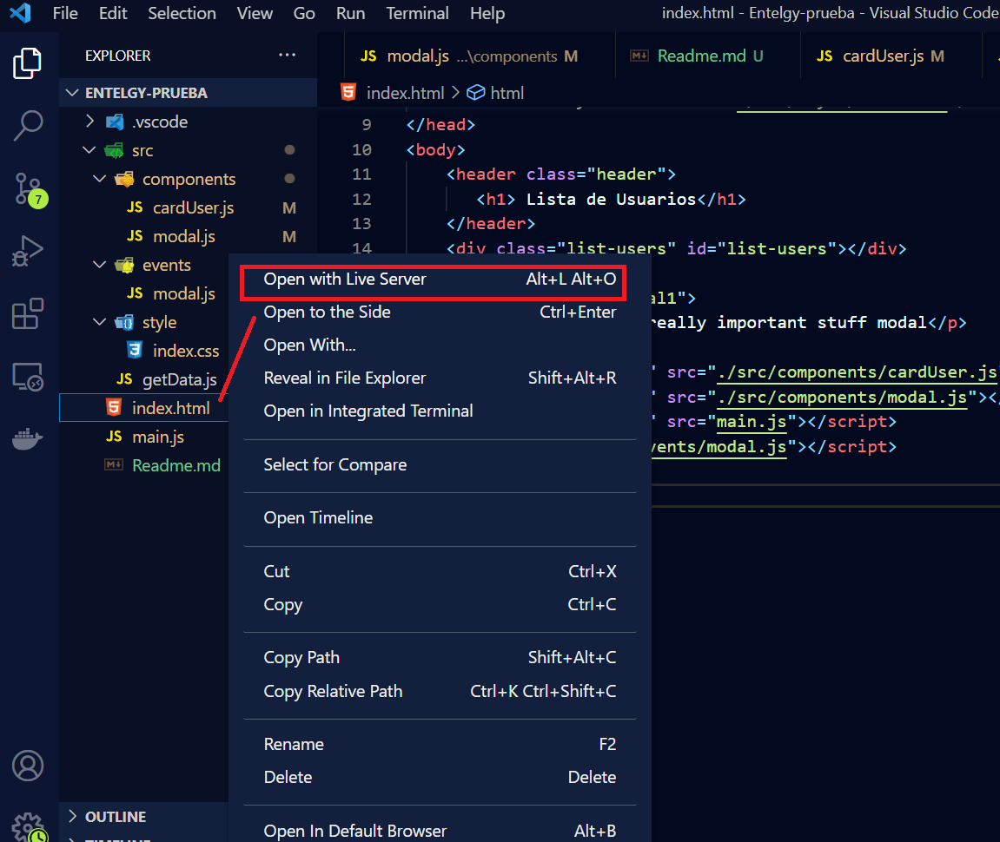
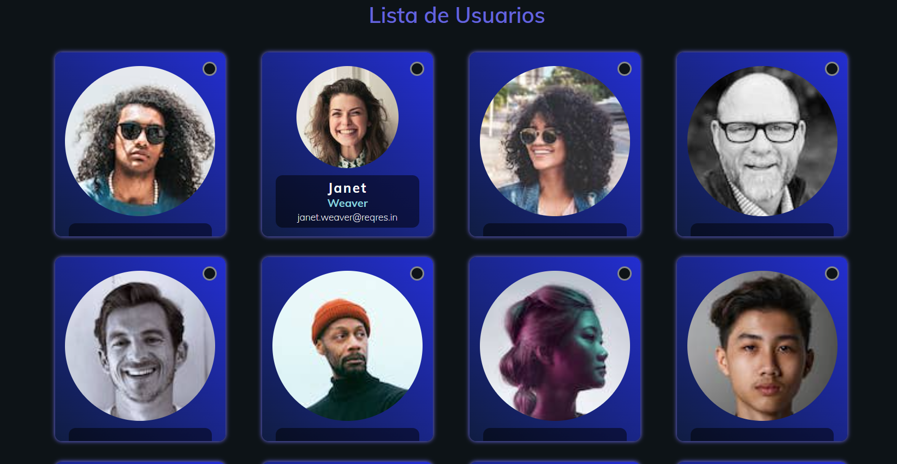
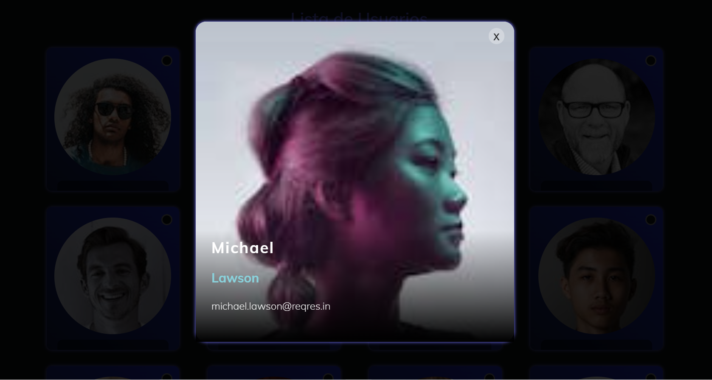

<h1 align="center"> Prueba ENTELGY</h1>

## Tabla de contenidos:

---

- [Componentes solicitados](#componentes-solicitados)
- [Manipulacion de componentes](#Manipulacion-de-componentes)
- [Colores de componente](#Colores-de-componente)
- [Ejecutar la prueba](#Ejecucion-de-la-Prueba)

## componentes solicitados

---
en esta ocasión los componentes solicitados son:
<ul>
    <li>Card User</li>
    <li>Modal </li>
</ul>

### Manipulacion de componente o custom element

* user-card:
    atributos: 
    - first_name: "variable donde va el nombre del usuario";
    - first_lastname: "variable donde va el nombre del apellido";
    - email: "variable donde va el email del usuario";
    - avatar: "variable donde va el url de la imagende usuario";

* user-modal:
    atributos: 
    - name: "variable donde va el nombre del usuario";
    - lastname: "variable donde va el nombre del apellido";
    - email: "variable donde va el email del usuario";
    - avatar: "variable donde va el url de la imagende usuario";
    - visible: "este atributo no tine valor pero se usa para mostrar el modal"

### Colores de componente:
user-card:
    variables: 
    <ul>
    <li>--primary-color: rgba(35,46,209,1);</li>
    <li>--secondary-color: rgba(16,29,66,1);</li>
     <li>--tertiary-color: rgba(101, 100, 219, 1);</li>
      <li>--quaternary-color:#89D2DC;</li>
    </ul>
        
---

## Ejecucion de la Prueba

---
para ejecutar la prueba se necesitara instalar un servidor en este caso puden instalar live-serve
para su ejecucion o cualquier otro servidor de desarrollo.

## lista de usuarios

## modal de usuarios

